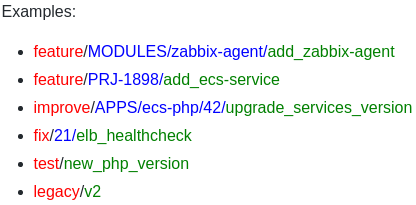
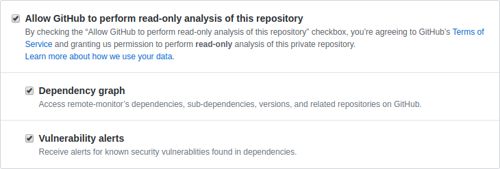
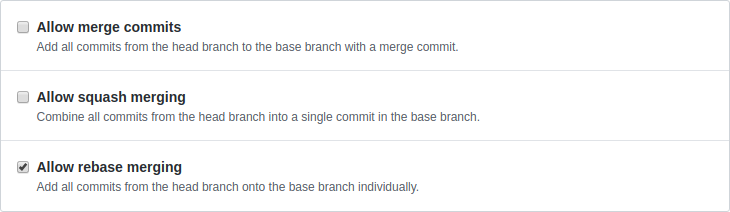
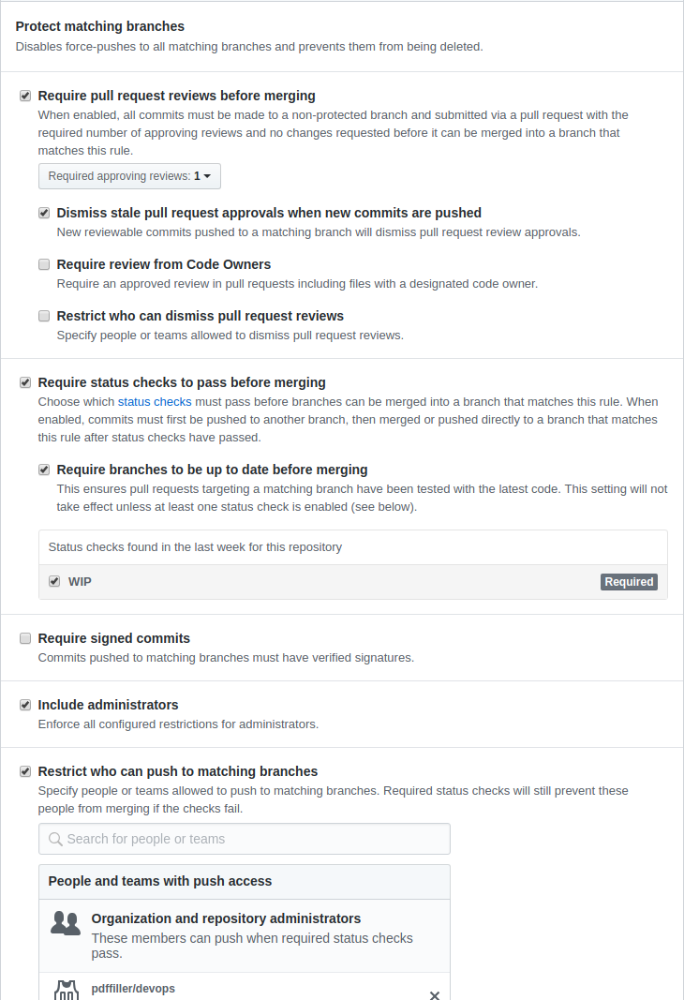

# styleguide-hooks

##### MENU

* [Dependencies](#dependencies)
* [Run tests](#run-tests)
* [How use hooks](#how-use-hooks)
* [Style guide](#style-guide)
  * [Commit message format](#commit-message-format)
  * [Branch naming format](#branch-naming-format)
  * [Limits for branches and commits](#limits-for-branches-and-commits)
* [Making changes to tracked branches](#making-changes-to-tracked-branches)
* [Setup protectection for repo](#setup-protectection-for-repo)
* [Git useful links](#git-useful-links)

## Dependencies

* bash 4+

## Run tests

1. Install [bats](https://github.com/sstephenson/bats)

```bash
git clone https://github.com/sstephenson/bats.git
sudo bats/install.sh /usr/local
rm -rf bats
```

2. Run tests

```bash
cd tests
./all-tests.sh
```

## How to use the hooks

#### 1. Clone this repo

```bash
git clone git@github.com:pdffiller/styleguide-hooks.git
```

#### 2. Setup it as your [template directory](https://git-scm.com/docs/git-init#_template_directory)

```bash
git config --global init.templatedir $(pwd)/styleguide-hooks
```

You may ignore the remainder **nevertheless it's better to follow the next steps** in order to avoid running `git init` each time the 'global' hooks are changed or updated.

#### 3. Create symlink to hooks

```bash
git config --global core.hooksPath $(pwd)/styleguide-hooks/hooks
```

Via post-checkout hook you create/recreate the symlink to your hooks directory after every `git clone` of `git checkout`. [Documentation](https://git-scm.com/docs/githooks#_post_checkout).

#### 4. If need - change default configuration

1. Looks on `hooks/_default_settings.sh`<br>
If you'd like change something:
2. Create `hooks/_user_defined_settings.sh`
3. Copy settings for change from `default` to `user_defined`
4. Change settings in `hooks/_user_defined_settings.sh`

#### 5. Make it always up-to-date

TODO: You can [add to cron and setup post-update hook](https://habr.com/post/329804/).

## Style guide

Each feature, bug fix or any other change must be developed in a separate branch.

### Commit message format

#### 1. Every commit message MUST start with a capitalized verb in its base form

Example:

```bash
Add
Delete
Change
Fix
Update
Correct
Test
...
```

The only exception allowed is `Initial commit`

**Reasons:**

* Has advantages with automatic code-review
* Makes reading easier
* Reduces the number of characters in the commit message (for example, `Add` versus `Was added` or `Has been added`)
* Matches the format accepted by git itself

When making a commit message, just mentally add a phrase in front of it `"When this commit is applied the git will ..."` and your commit message should logically continue this phrase.

For example:<br>


#### 2. Punctuation marks are omitted at the end

Example:<br>
`Add new feature` instead of `Add new feature.`)

#### 3. Length of the commit message should not exceed 50 characters

It's git recommendation and soft limit, 50+ characters can be truncated when displayed.<br>
Hard limit - 72 characters.

#### Another useful practices

* https://chris.beams.io/posts/git-commit
* https://alistapart.com/article/the-art-of-the-commit
* https://robots.thoughtbot.com/5-useful-tips-for-a-better-commit-message
* https://github.com/erlang/otp/wiki/writing-good-commit-messages
* https://wiki.openstack.org/wiki/GitCommitMessages
* https://tbaggery.com/2008/04/19/a-note-about-git-commit-messages.html
* https://dev.to/gonedark/when-to-make-a-git-commit

### Branch naming format

Used pattern: `issue_type / [path_to_folder /] [Jira issue ID /| GitHub issue # /] short_description`

* `short_description`: a ***short phrase*** reflecting the essence of the changes, with a separator `_`
* `Jira issue ID`: ***project name and issue number with a hyphen***
* `GitHub issue`: ***short numeric number*** of a specific issue previously created in this repository

#### Allowed issue_types

* `feature` - new functionality
* `improve` - improve existing functionality
* `fix` - various fixes and fixes
* `test` - branch for research, various tests, temporary copy, etc. It is useful, for example, for temporary merging of several branches that are not yet in the master for carrying out integration testing of these branches.
* `docs` - everything related to documentation
* `style` - fix typos, fix formatting
* `refactor` - refactoring application code
* `legacy` - in some cases, it may take a long time to parallelly develop several development directions in one repository (for example, we have already switched to the v3 module version, but for some terraform configurations, we need changes in the modules of v2 versions, and they will also need an indefinite long time). Such branches are strictly forbidden to be removed from the repository without the permission of the technical support.

Issue_type **must be** lowercase.

<!--
Examples:
* <span style="color:red">feature</span>/<span style="color:blue">MODULES/zabbix-agent/</span><span style="color:green">add_zabbix-agent</span>
* <span style="color:red">feature</span>/<span style="color:blue">PRJ-1898/</span><span style="color:green">add_ecs-service</span>
* <span style="color:red">improve</span>/<span style="color:blue">APPS/ecs-php/42/</span><span style="color:green">upgrade_services_version</span>
* <span style="color:red">fix</span>/<span style="color:blue">21/</span><span style="color:green">elb_healthcheck</span>
* <span style="color:red">test</span>/<span style="color:green">new_php_version</span>
* <span style="color:red">legacy</span>/<span style="color:green">v2</span>
-->



### Limits for branches and commits

#### 1. Every commit SHOULD BE <1000 changed lines

Exceptions:

* Terraform copy-paste development from one enviroment to another. But, if it new infrastucture - you MUST setup environment changes in separate commit.
* Vendor-dependency updates (such like in Go)
* Addition/Deletions/changes same little stuff in every file. Like `enviroment` -> `environment` 10000 times

#### 2. One change type - one branch

If you need make `fix` and `feature` - their MUST BE in different branches.

Exceptions:

* If:

  * you work with 1 (<1000 lines) functional autonomy file which not affect any other
  * you make `refactor` and some other stuff
  * All changes in sum be <1000

#### 3. One feature - one branch

If you add many clusters which not depend on each other - they MUST BE in diferent branches.

## Making changes to tracked branches

### Definitions & basic info

Tracked branch is a branch, changes in which are tracked by any build-configuration of Teamcity or another CI process or tool.

Work branch is a branch that has budded off from any one being tracked to make changes to the code, and after that it will be rebased again with the parent branch.

Making any changes to the tracked branches should take place exclusively through pull request.

> 

> Otherwise nobody is able to forcast all the consequences of such usage.

Use only stable, tracked branches on GitHub in your applications!

### Before review

Make sure that the working branch does not conflict with the parent branch.

### Merging work branch

The corresponding pull request can be merged into the tracked branch only after succesfull review at least one review.

Merge is performed by executing the "rebase and merge" command — a special button at the bottom of the page — from the interface of this pull request in GitHub.

### Deleting work branch

Right after the working branch ~~is returned to the church~~ is rebased into the tracked branch - deleted. Branch is to be deleted by the PR assignee who perform the rebase.

## Setup protectection for repo

Go to repo Settings.

### Options - Data services

If private repo - enable Vulnerability alerts. In public it enable by default.



### Options - Merge button

Allow only Rebase



### Branch - Branch protection rules

WIP check can be found [here](https://github.com/marketplace/wip).

Also, you can enable WIP check protection (or any other) only after create first pull request.



Protection rules can be enforced by [enforce_branch_protection.py](https://github.com/pdffiller/styleguide-hooks/blob/stable/scripts/enforce_branch_protection.py) script.

## Git useful links

* [ProGit 2](https://git-scm.com/book/en/v2) [:ukraine:](https://git-scm.com/book/uk/v2)
* [Try Git](https://try.github.io/)
* [Try Git Branching](http://learngitbranching.js.org/)
* [Interactive diagram/cheatsheet about git](http://ndpsoftware.com/git-cheatsheet.html)
* [You're using git wrong](https://web.archive.org/web/20181029051129/https://dpc.pw/blog/2017/08/youre-using-git-wrong/)
